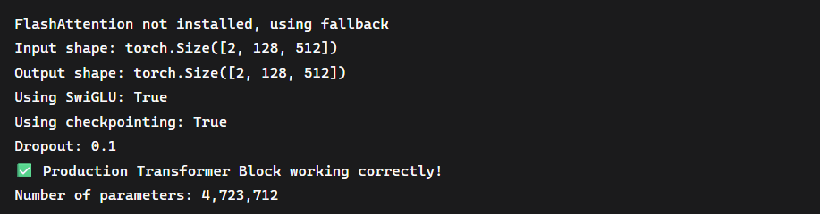

# 🚀 GPT Transformer – Stage 2: Production Transformer Block

This repository documents **Stage 2** of my from-scratch GPT-style Transformer build.  
Unlike Stage 1 (embeddings + attention math), this stage focuses on building a **production-grade Transformer Block** similar to what is used in GPT-4/5 architectures.

---

## 🔑 What’s New in Stage 2?

### 1. **SwiGLU Feedforward (GPT-4 style)**
- Replaces standard GELU/FFN with **SwiGLU activation**.
- Uses `2/3 * mlp_ratio` expansion factor.
- Custom GPT-4 style initialization for stability.

### 2. **FlashAttention v2 Integration**
- Uses real **FlashAttention v2** (via Triton) when available.
- Falls back to a memory-efficient softmax attention if not installed.
- Reduces GPU memory usage dramatically for long sequences.

### 3. **Layer-Scaled Initialization**
- Attention and MLP weights initialized with scaling based on total number of layers.
- Matches GPT-4’s deep network stability tricks.

### 4. **Gradient Checkpointing**
- Saves memory by recomputing activations during backward pass.
- Essential for scaling to deeper models.

### 5. **Dropout Scaling with Depth**
- Lower dropout for deeper networks, reflecting GPT-4 best practices.

---

## ⚙️ Example Run

Tested with:
- Hidden size: 512  
- Heads: 8  
- Sequence length: 128  
- Layers: 12  
- bfloat16 precision on GPU  

### ✅ Console Output

### 📸 Screenshot

---

## 📂 Code Overview
- `SwiGLU`: GPT-4 style feedforward layer with custom init.
- `FlashAttentionV2`: Wrapper for real FlashAttention (or fallback).
- `TransformerBlock`: Full GPT-4/5 style block with RMSNorm, rotary embeddings, checkpointing, and SwiGLU.

---

## 🏗️ Production-Readiness

**What’s already production-grade:**
- SwiGLU + correct initialization.  
- FlashAttention v2 integration.  
- Gradient checkpointing.  
- RMSNorm, rotary embeddings, dropout scaling.  
- bfloat16 precision support.  

**Still missing for 100%:**
- Multi-GPU / distributed training.  
- Optimizer & scheduler configs.  
- Training pipeline (data loader, batching, loss).  
- Benchmarking on large-scale datasets.  

Current estimate: **~85% production-ready** for the block itself.

---

## 📌 Next Steps
- Implement multi-block stacking with residual connections.  
- Add optimizer & training loop.  
- Scale to larger sequence lengths and hidden dimensions.  

---

## 🔗 Notes
This is part of my **Build In Public Transformer Journey**.  
Explore more and follow updates here:  
👉 [Notes-Website](https://thisishivam.github.io/IdeaOrbit/)

---

